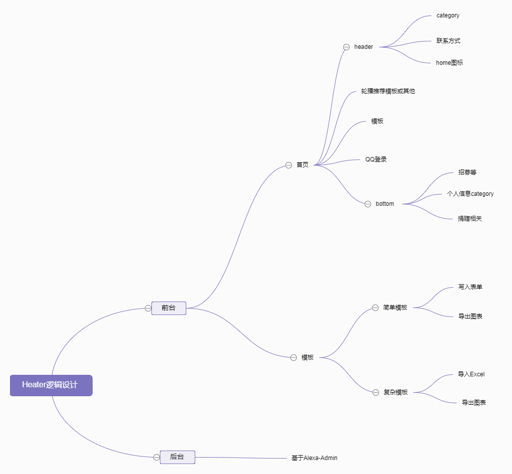
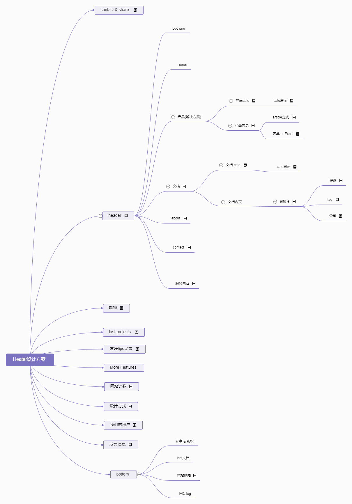

#  Heater  #

= Heater is an application based on Echarts' online production chart.

----------

Heater - 一个免费开源的在线图表制作应用. 她将你从Spss这样的软件中解放出来

>感谢名单,排名不分先后.
>
>Heater
Echarts,站长素材,X-Admin,Alexa-Admin,七牛云,ThinkPHP5,U钙网,JQuery,Bootstrap,阿里巴巴矢量图标库

